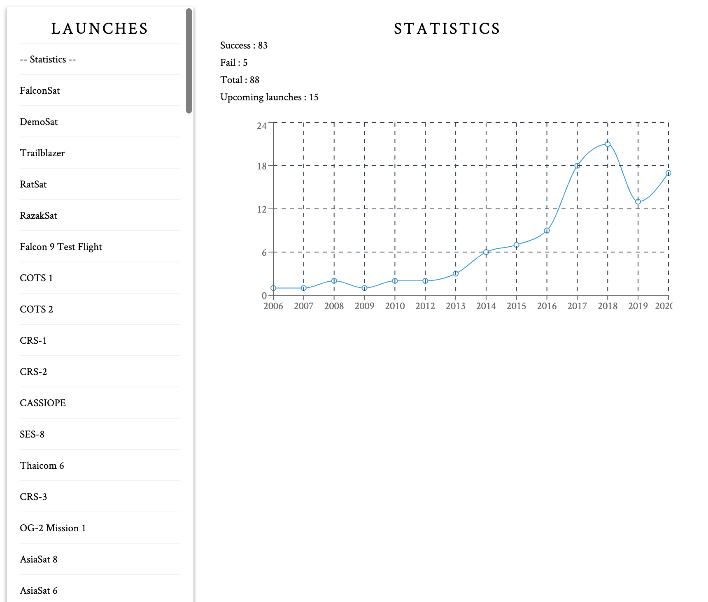
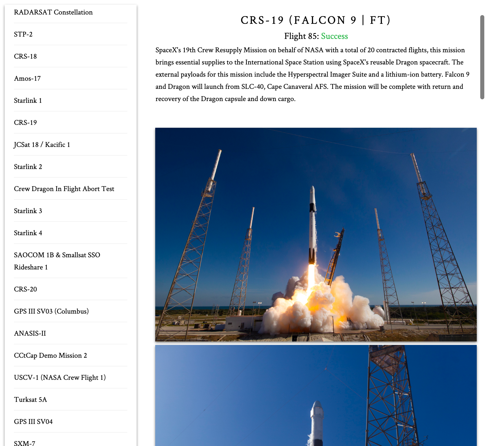

### GraphQL React TS Project

The base of the app use this tutorial :  
https://levelup.gitconnected.com/build-a-graphql-react-app-with-typescript-9661f908b26

Basic app to learn to implement GraphQL in React TypeScript environment.

